# Firefly 博客项目 - AI 开发指南

> 基于 Astro 的现代化个人博客系统
> 最后更新：2025-11-12 16:41:02

---

## 变更记录 (Changelog)

### 2025-11-12 16:41:02 - 初始化 AI 上下文
- 创建项目架构文档
- 生成模块结构图和导航体系
- 记录核心配置与技术栈

---

## 项目愿景

**Firefly** 是一款清新美观的 Astro 博客主题模板，专为个人博客打造。项目基于 [Fuwari](https://github.com/saicaca/fuwari) 和 [Mizuki](https://github.com/matsuzaka-yuki/Mizuki) 进行二次开发，提供：

- ⚡ 超快的静态站点生成和 SEO 优化
- 🎨 现代化设计与自定义主题色支持
- 📱 完美的响应式体验
- 🌟 Spine/Live2D 看板娘支持
- 🔧 高度可配置的功能模块

**目标用户**：希望快速搭建个人博客、注重视觉体验和性能的开发者与内容创作者。

---

## 架构总览

### 技术栈

- **前端框架**：Astro 5.14.7（SSG）
- **UI 框架**：Svelte 5.41.1（交互组件）
- **样式**：TailwindCSS 3.4.17 + Stylus
- **部署**：Cloudflare Pages + Workers（适配器 @astrojs/cloudflare）
- **包管理**：pnpm 9.14.4
- **代码质量**：Biome 2.2.6（格式化 + Lint）
- **搜索**：Pagefind 1.4.0
- **内容管理**：Astro Content Collections（基于 Markdown）

### 核心特性

1. **静态生成 (SSG)**：构建时预渲染所有页面，CDN 部署，加载极速
2. **Markdown 驱动**：文章基于 `src/content/posts/` 目录，支持 frontmatter 元数据
3. **模块化配置**：`src/config/` 下拆分站点、主题、评论、插件等配置
4. **自定义插件**：Remark/Rehype 插件支持 Mermaid、数学公式、自定义指令
5. **多语言支持**：内置中文（简繁）、英文、日文语言包
6. **SEO 友好**：自动生成 sitemap、RSS、robots.txt，可选 OG 图片生成

---

## 模块结构图

```mermaid
graph TD
    A["(根) Firefly 博客"]
    A --> B["src/pages - 页面路由"]
    A --> C["src/components - UI 组件"]
    A --> D["src/config - 配置中心"]
    A --> E["src/content - 内容管理"]
    A --> F["src/plugins - 构建插件"]
    A --> G["src/utils - 工具函数"]
    A --> H["src/layouts - 布局模板"]
    A --> I["scripts - 构建脚本"]
    A --> J["public - 静态资源"]

    click B "#module-pages" "查看页面模块文档"
    click C "#module-components" "查看组件模块文档"
    click D "#module-config" "查看配置模块文档"
    click E "#module-content" "查看内容模块文档"
    click F "#module-plugins" "查看插件模块文档"
    click G "#module-utils" "查看工具模块文档"

    B --> B1["首页/归档/友链"]
    B --> B2["文章详情页"]
    B --> B3["项目/技能/时间线"]

    C --> C1["widget - 侧边栏组件"]
    C --> C2["comment - 评论系统"]
    C --> C3["control - 通用控件"]

    D --> D1["siteConfig - 站点配置"]
    D --> D2["主题/字体/插件配置"]

    E --> E1["posts - 博客文章"]
    E --> E2["spec - 特殊页面"]

    F --> F1["remark - Markdown 处理"]
    F --> F2["rehype - HTML 处理"]
```



---

## 模块索引

| 模块路径 | 职责 | 关键文件 | 文档链接 |
|---------|------|---------|---------|
| **src/pages** | 页面路由与动态路由 | `[...page].astro`, `posts/[...slug].astro` | [详情](#module-pages) |
| **src/components** | UI 组件库（Astro + Svelte） | `Navbar.astro`, `widget/*` | [详情](#module-components) |
| **src/config** | 配置中心 | `siteConfig.ts`, `index.ts` | [详情](#module-config) |
| **src/content** | 内容管理（Markdown） | `posts/**/*.md`, `config.ts` | [详情](#module-content) |
| **src/plugins** | 构建插件（Remark/Rehype） | `remark-*.js`, `rehype-*.mjs` | [详情](#module-plugins) |
| **src/utils** | 工具函数 | `url-utils.ts`, `content-utils.ts` | [详情](#module-utils) |
| **src/layouts** | 布局模板 | `Layout.astro`, `MainGridLayout.astro` | [详情](#module-layouts) |
| **scripts** | 构建与脚本 | `new-post.js`, `fix-routes.js` | [详情](#module-scripts) |
| **public** | 静态资源 | `assets/`, `pio/` (看板娘资源) | [详情](#module-public) |

---

## <a id="module-pages"></a>页面模块 (src/pages)

**核心职责**：定义站点路由结构，处理 SSG 页面生成。

### 主要页面

- **`[...page].astro`**：首页与分页列表
- **`posts/[...slug].astro`**：文章详情页（动态路由）
- **`archive.astro`**：归档页（按年月分组）
- **`friends.astro`**：友链页
- **`projects.astro`**：项目展示页
- **`skills.astro`**：技能展示页
- **`timeline.astro`**：时间线页
- **`anime.astro`**：追番页（Bangumi API 集成）
- **`og/[...slug].png.ts`**：动态 OG 图片生成（可选）

### 页面开关

通过 `src/config/siteConfig.ts` 中的 `pages` 字段控制特定页面的访问权限：

```typescript
pages: {
  anime: true,      // 追番页面
  projects: true,   // 项目页面
  timeline: true,   // 时间线页面
  skills: true      // 技能页面
}
```

---

## <a id="module-components"></a>组件模块 (src/components)

**核心职责**：提供可复用的 UI 组件，分为 Astro 静态组件和 Svelte 交互组件。

### 目录结构

```
src/components/
├── widget/          # 侧边栏/卡片组件（TOC、Profile、Tags、Categories 等）
├── comment/         # 评论系统（Twikoo）
├── control/         # 通用控件（按钮、分页、返回顶部）
├── misc/            # 杂项（图标、License、ImageWrapper）
├── Navbar.astro     # 顶部导航栏
├── Footer.astro     # 页脚
├── PostCard.astro   # 文章卡片
└── Search.svelte    # 搜索面板（基于 Pagefind）
```

### 关键组件

- **`Navbar.astro`**：响应式导航栏，支持透明模式（banner/semi/full/semifull）
- **`widget/TOC.astro`**：桌面端目录组件
- **`MobileTOC.svelte`**：移动端目录/底部导航
- **`Search.svelte`**：全局搜索（集成 Pagefind）
- **`DisplaySettings.svelte`**：主题色/亮暗模式切换面板
- **`SpineModel.astro` / `Live2DWidget.astro`**：看板娘组件

---

## <a id="module-config"></a>配置模块 (src/config)

**核心职责**：集中管理站点配置，支持模块化导入。

### 配置文件清单

| 文件 | 用途 |
|------|------|
| `index.ts` | 配置索引，统一导出 |
| `siteConfig.ts` | 站点基础配置（标题、语言、主题色、页面开关） |
| `profileConfig.ts` | 用户资料配置 |
| `navBarConfig.ts` | 导航栏菜单配置 |
| `commentConfig.ts` | 评论系统配置（Twikoo） |
| `fontConfig.ts` | 字体配置 |
| `sakuraConfig.ts` | 樱花特效配置 |
| `pioConfig.ts` | 看板娘配置（Spine/Live2D） |
| `musicConfig.ts` | 音乐播放器配置 |
| `friendsConfig.ts` | 友链配置 |
| `licenseConfig.ts` | 文章许可证配置 |
| `footerConfig.ts` | 页脚配置 |

### 配置示例

```typescript
// 从 src/config/index.ts 统一导入
import { siteConfig, profileConfig, navBarConfig } from '@/config';

// 使用配置
console.log(siteConfig.title); // "johntime 的博客"
```

---

## <a id="module-content"></a>内容模块 (src/content)

**核心职责**：管理 Markdown 内容，通过 Astro Content Collections 提供类型安全的内容查询。

### 目录结构

```
src/content/
├── config.ts               # 定义 Collection 类型
├── posts/                  # 博客文章目录
│   ├── tutorials/          # 教程文章
│   ├── wordpress-import/   # WordPress 导入的文章
│   └── draft.md            # 草稿示例
└── spec/                   # 特殊页面（about.md、friends.md）
```

### Frontmatter 字段

```yaml
---
title: 文章标题              # 必填
published: 2025-01-01       # 必填，发布日期
updated: 2025-01-02         # 可选，更新日期
draft: false                # 是否为草稿
description: 文章摘要        # SEO 描述
image: ./cover.jpg          # 封面图
tags: [标签1, 标签2]         # 标签数组
category: 分类名             # 分类（单个）
lang: zh_CN                 # 文章语言（默认继承站点语言）
pinned: false               # 是否置顶
encrypted: false            # 是否加密（需密码访问）
password: ""                # 加密密码
series: 系列名               # 系列文章

# 高级可见性控制
visibility: "public"        # 可见性级别：public | unlisted | private
hideFromHome: false         # 从首页隐藏
hideFromArchive: false      # 从归档页隐藏
hideFromSearch: false       # 从搜索结果隐藏
showInWidget: true          # 是否在侧边栏组件显示

# 排序与推荐
customOrder: 1              # 自定义排序优先级（数字越小越靠前）
featuredLevel: 0            # 推荐级别 (0-5)

# 布局控制
postLayout: "default"       # 布局模板：default | wide | fullscreen | no-sidebar

# SEO 精细控制
seoNoIndex: false           # 禁止搜索引擎索引
seoNoFollow: false          # 禁止搜索引擎跟踪链接

# 访问控制
accessLevel: "public"       # 访问级别：public | members-only | restricted
---
```

> **详细文档**：请查阅 [ADVANCED_POST_MANAGEMENT.md](./ADVANCED_POST_MANAGEMENT.md) 获取完整的高级文章管理功能指南。

### 内容查询示例

```typescript
import { getCollection } from 'astro:content';

// 获取所有已发布文章
const posts = await getCollection('posts', ({ data }) => !data.draft);

// 按分类过滤
const tutorialPosts = posts.filter(p => p.data.category === 'tutorials');
```

---

## <a id="module-plugins"></a>插件模块 (src/plugins)

**核心职责**：扩展 Markdown 处理能力，支持自定义语法和渲染逻辑。

### Remark 插件（处理 Markdown AST）

- **`remark-reading-time.mjs`**：计算阅读时间
- **`remark-excerpt.js`**：提取摘要
- **`remark-mermaid.js`**：预处理 Mermaid 图表
- **`remark-directive-rehype.js`**：处理自定义指令（如 `:::note`）

### Rehype 插件（处理 HTML AST）

- **`rehype-mermaid.mjs`**：渲染 Mermaid 图表为 SVG
- **`rehype-component-admonition.mjs`**：渲染提示框组件（note/tip/warning 等）
- **`rehype-component-github-card.mjs`**：渲染 GitHub 卡片

### Expressive Code 插件

- **`custom-copy-button.ts`**：自定义代码块复制按钮
- **`language-badge.ts`**：显示代码语言标签

### 配置位置

所有插件在 `astro.config.mjs` 中注册：

```javascript
markdown: {
  remarkPlugins: [
    remarkMath,
    remarkReadingTime,
    remarkExcerpt,
    // ...
  ],
  rehypePlugins: [
    rehypeKatex,
    rehypeMermaid,
    // ...
  ]
}
```

---

## <a id="module-utils"></a>工具模块 (src/utils)

**核心职责**：提供通用工具函数，避免代码重复。

### 关键工具

- **`url-utils.ts`**：URL 处理（路径拼接、比较）
- **`date-utils.ts`**：日期格式化
- **`content-utils.ts`**：内容处理（排序、过滤、分组）
- **`setting-utils.ts`**：主题设置（亮暗模式、主题色）
- **`navigation-utils.ts`**：导航逻辑
- **`icon-loader.ts`**：图标加载
- **`widget-manager.ts`**：侧边栏 widget 管理
- **`sakura-manager.ts`**：樱花特效管理

---

## <a id="module-layouts"></a>布局模块 (src/layouts)

**核心职责**：定义页面布局结构。

- **`Layout.astro`**：根布局（包含 `<head>`、主题切换、全局脚本）
- **`MainGridLayout.astro`**：主栅格布局（左侧边栏 + 中间内容 + 右 TOC）

---

## <a id="module-scripts"></a>脚本模块 (scripts)

**核心职责**：辅助开发与构建。

- **`new-post.js`**：快速创建新文章模板
  ```bash
  pnpm new-post my-new-post
  ```
- **`fix-routes.js`**：修复 Cloudflare Pages 路由配置
- **`wordpress-to-markdown.js`**：WordPress 内容迁移脚本

---

## <a id="module-public"></a>静态资源模块 (public)

**核心职责**：存放构建时直接复制到 `dist/` 的静态文件。

```
public/
├── assets/
│   ├── images/         # 图片资源（logo、favicon、banner）
│   ├── css/            # 第三方 CSS（highlight 主题）
│   └── js/             # 第三方 JS（bcrypt、twikoo）
└── pio/                # 看板娘资源
    ├── models/         # Spine/Live2D 模型数据
    └── static/         # 看板娘库文件
```

---

## 运行与开发

### 环境要求

- Node.js ≥ 18
- pnpm ≥ 9

### 常用命令

| 命令 | 说明 |
|------|------|
| `pnpm install` | 安装依赖 |
| `pnpm dev` | 启动开发服务器（http://localhost:4321） |
| `pnpm build` | 构建生产版本（输出到 `dist/`） |
| `pnpm preview` | 预览构建结果 |
| `pnpm new-post <filename>` | 创建新文章 |
| `pnpm format` | 格式化代码（Biome） |
| `pnpm lint` | Lint 代码（Biome） |

### 部署

- **推荐平台**：Cloudflare Pages（已配置适配器）
- **其他平台**：Vercel、Netlify、GitHub Pages（参考 [Astro 部署指南](https://docs.astro.build/zh-cn/guides/deploy/)）

---

## 测试策略

### 当前状态

- **单元测试**：未配置（项目主要为静态内容，测试需求较低）
- **E2E 测试**：未配置
- **手动测试**：通过 `pnpm dev` 和 `pnpm preview` 进行本地验证

### 建议

- 对于复杂交互组件（如搜索、评论系统），可考虑添加 Playwright E2E 测试
- 对于工具函数（`src/utils`），可添加 Vitest 单元测试

---

## 编码规范

### 代码风格

- **格式化工具**：Biome（配置文件：`biome.json`）
- **缩进**：Tab
- **引号**：双引号
- **行宽**：无限制（Biome 默认）

### 命名约定

- **文件名**：PascalCase（组件）、kebab-case（工具函数）
- **组件**：使用 `.astro` 后缀（静态组件）或 `.svelte` 后缀（交互组件）
- **配置文件**：使用 `*Config.ts` 后缀

### 组件设计原则

1. **单一职责**：每个组件只负责一个功能
2. **Props 类型定义**：使用 TypeScript 接口定义 Props
3. **样式隔离**：使用 Astro 的 scoped 样式或 Tailwind 工具类
4. **避免全局污染**：避免在组件中直接修改 `window` 对象

---

## AI 使用指引

### 适合 AI 辅助的任务

1. **新建文章**：提供标题和大纲，AI 生成符合 frontmatter 规范的 Markdown 文件
2. **配置调整**：描述需求，AI 修改 `src/config/*.ts` 文件
3. **组件开发**：提供设计稿或需求，AI 生成 Astro/Svelte 组件
4. **插件开发**：描述 Markdown 扩展需求，AI 编写 Remark/Rehype 插件
5. **样式调整**：描述 UI 需求，AI 修改 Tailwind 类名或编写自定义 CSS

### AI 应注意的限制

- **不修改源代码结构**：除非明确要求重构
- **保持配置一致性**：修改配置时确保所有引用处同步更新
- **遵循现有命名规范**：避免引入新的命名风格
- **测试修改**：提醒用户运行 `pnpm dev` 验证修改

### 常见 AI 任务示例

#### 任务 1：创建新文章

**用户输入**：
"帮我创建一篇关于 Astro 性能优化的文章，标题为《Astro 性能优化最佳实践》"

**AI 操作**：
```bash
pnpm new-post astro-performance-best-practices
```

然后编辑生成的文件，填充 frontmatter 和内容。

#### 任务 2：修改主题色

**用户输入**：
"把主题色改为蓝绿色（色相 180）"

**AI 操作**：
修改 `src/config/siteConfig.ts`：
```typescript
themeColor: {
  hue: 180,  // 原值 155
  // ...
}
```

#### 任务 3：添加新页面

**用户输入**：
"添加一个 `/about/team` 页面，展示团队成员"

**AI 操作**：
1. 创建 `src/pages/about/team.astro`
2. 编写页面组件
3. （可选）在 `src/config/navBarConfig.ts` 中添加导航链接

---

## 相关文档与资源

### 官方文档

- [Astro 官方文档](https://docs.astro.build/)
- [Svelte 文档](https://svelte.dev/)
- [TailwindCSS 文档](https://tailwindcss.com/)
- [Cloudflare Pages 文档](https://developers.cloudflare.com/pages/)

### 主题与参考

- [Firefly 原主题](https://github.com/CuteLeaf/Firefly)
- [Fuwari 基础主题](https://github.com/saicaca/fuwari)
- [Mizuki 二次开发主题](https://github.com/matsuzaka-yuki/Mizuki)

### 项目特定文档

- [部署指南](./DEPLOYMENT.md) - Cloudflare Pages 部署详细步骤
- [配置说明](./src/config/README.md) - 配置文件详细说明
- [性能优化指南](./src/docs/animation-performance-guide.md) - 动画性能优化建议

---

## 常见问题 (FAQ)

### Q1：如何修改网站标题和描述？

**A**：编辑 `src/config/siteConfig.ts`，修改 `title` 和 `description` 字段。

### Q2：如何添加新的导航菜单？

**A**：编辑 `src/config/navBarConfig.ts`，在 `navBarConfig.links` 数组中添加新项。

### Q3：如何禁用看板娘？

**A**：编辑 `src/config/pioConfig.ts`，设置 `spineModelConfig.enable = false` 和 `live2dModelConfig.enable = false`。

### Q4：如何启用评论系统？

**A**：编辑 `src/config/commentConfig.ts`，设置 `commentConfig.enable = true`，并配置 Twikoo 环境 ID。

### Q5：构建时提示内存不足怎么办？

**A**：增加 Node.js 内存限制：
```bash
NODE_OPTIONS="--max-old-space-size=4096" pnpm build
```

### Q6：如何自定义 404 页面？

**A**：编辑 `src/pages/404.astro`。

### Q7：如何添加 Google Analytics？

**A**：在 `src/layouts/Layout.astro` 的 `<head>` 中添加 GA 脚本（已有 GTM 和 Clarity 示例）。

---

## 技术债务与待改进项

### 已知问题

1. **OG 图片生成慢**：`generateOgImages` 功能构建时间长，默认关闭
2. **部分类型定义不完整**：`tsconfig.json` 中 `strictNullChecks` 和 `strict` 均为 `false`
3. **缺少单元测试**：工具函数和插件未覆盖测试

### 改进建议

1. **启用严格类型检查**：逐步修复类型错误，启用 `strict` 模式
2. **添加测试覆盖**：为 `src/utils` 和 `src/plugins` 添加 Vitest 测试
3. **性能优化**：减少首页 JS 体积，懒加载非关键组件
4. **文档完善**：为所有配置选项添加中文注释

---

## 联系与支持

- **原作者**：CuteLeaf（[Firefly 仓库](https://github.com/CuteLeaf/Firefly)）
- **本项目维护者**：johntime（[本仓库](https://github.com/johntime2005/blog)）
- **问题反馈**：[GitHub Issues](https://github.com/johntime2005/blog/issues)

---

**祝开发愉快！🚀**
