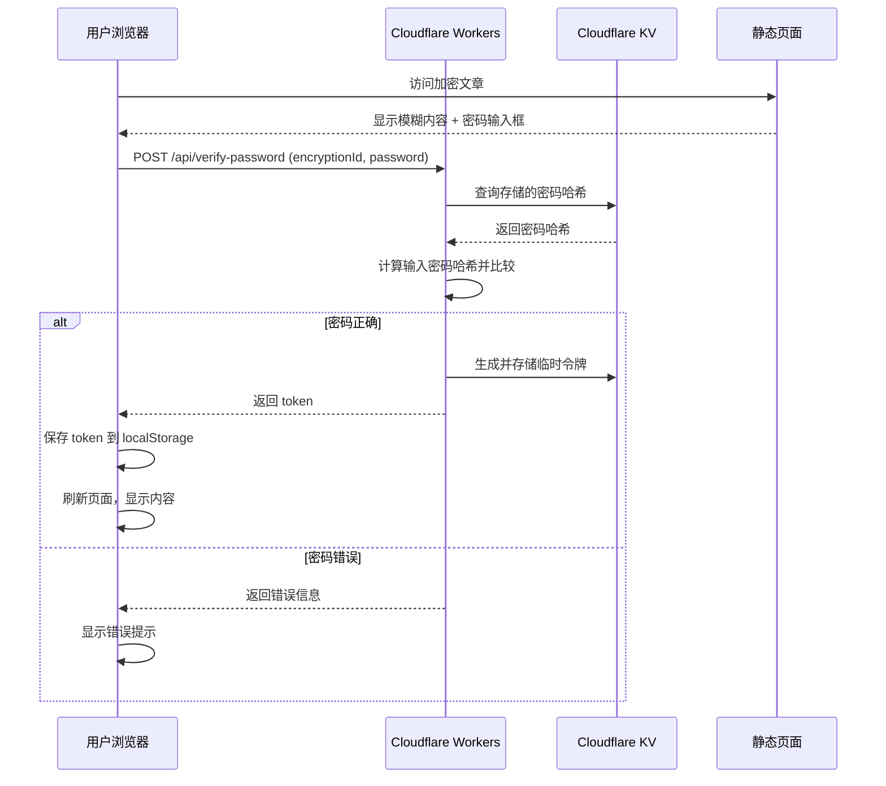

# 🔐 文章加密系统 - 完整使用指南

> **真正的服务端加密方案**
> 基于 Cloudflare Workers + KV 存储，密码安全存储在云端，前后端分离验证

---

## 📖 目录

1. [功能特性](#功能特性)
2. [工作原理](#工作原理)
3. [配置步骤](#配置步骤)
4. [使用流程](#使用流程)
5. [常见问题](#常见问题)
6. [安全说明](#安全说明)

---

## 功能特性

### ✅ 真正的安全

- **密码不在 Git 中存储**：密码存储在 Cloudflare KV，永远不会提交到代码仓库
- **服务端验证**：密码验证在 Cloudflare Workers 中进行，无法被前端绕过
- **SHA-256 哈希**：密码以哈希形式存储，即使 KV 泄露也无法反推原密码
- **临时令牌机制**：验证成功后生成临时令牌（1 小时有效），减少密码传输

### ⚡ 优秀的体验

- **美观的 UI**：现代化的密码输入界面
- **自动记忆**：验证成功后保存令牌到本地存储，1 小时内无需重复输入
- **即时反馈**：密码错误时立即提示，无需等待页面刷新
- **无感集成**：对未加密文章完全透明，不影响正常阅读

---

## 工作原理



---

## 配置步骤

### 步骤 1：创建 Cloudflare KV 命名空间

1. 登录 [Cloudflare Dashboard](https://dash.cloudflare.com/)
2. 进入 **Workers & Pages** → **KV**
3. 点击 **Create namespace**
4. 命名为：`POST_ENCRYPTION`
5. 创建成功后，记录 **Namespace ID**（类似 `abc123def456...`）

### 步骤 2：配置 wrangler.toml（重要）

⚠️ **你的项目通过 `wrangler.toml` 管理配置，不能在 Dashboard 中手动绑定！**

打开项目根目录的 `wrangler.toml` 文件，将 Namespace ID 填入：

```toml
name = "blog"
compatibility_date = "2025-11-18"

[[kv_namespaces]]
binding = "POST_ENCRYPTION"
id = "abc123def456789"  # ← 替换为你的 KV Namespace ID
```

**详细配置步骤：** 查看 [WRANGLER_SETUP.md](./WRANGLER_SETUP.md)

### 步骤 3：提交并部署

```bash
# 添加配置文件
git add wrangler.toml

# 提交
git commit -m "feat: 添加 KV 绑定配置用于文章加密"

# 推送到 GitHub（触发自动部署）
git push origin main
```

部署完成后，Cloudflare Pages 会自动应用 `wrangler.toml` 中的配置。

### 步骤 4：获取 Cloudflare API 凭证

#### 4.1 获取 Account ID

- 在 Cloudflare Dashboard 右侧可以看到 **Account ID**
- 复制保存

#### 4.2 创建 API Token

1. 进入 **My Profile** → **API Tokens**
2. 点击 **Create Token**
3. 选择模板：**Edit Cloudflare Workers**
4. 或自定义权限：
   - **Account** → **Workers KV Storage** → **Edit**
5. 创建后复制 Token（只显示一次，请妥善保存）

### 步骤 5：配置本地环境

1. 复制示例配置文件：
   ```bash
   cp .env.encryption.example .env.encryption
   ```

2. 编辑 `.env.encryption`，填入凭证：
   ```bash
   CLOUDFLARE_ACCOUNT_ID=your-account-id-here
   CLOUDFLARE_API_TOKEN=your-api-token-here
   CLOUDFLARE_KV_NAMESPACE_ID=your-kv-namespace-id-here
   ```

3. 确保 `.env.encryption` 已添加到 `.gitignore`（已默认添加）

---

## 使用流程

### 方式 1：使用管理后台（推荐）⭐

**可视化管理，自动生成强密码，无需命令行！**

1. **访问管理后台**：`https://your-blog.pages.dev/admin/encryption`
2. **登录**（使用管理员密码）
3. **选择文章 → 点击"启用加密"**
4. **系统自动生成强密码并显示**
5. **复制密码和配置代码**
6. **手动更新文章 frontmatter**
7. **提交并部署**

**详细指南**：查看 [ADMIN_DASHBOARD_GUIDE.md](./ADMIN_DASHBOARD_GUIDE.md)

---

### 方式 2：使用 CLI 工具

#### 1. 为文章设置密码

使用 CLI 工具设置密码：

```bash
pnpm manage-password set my-secret-post MyPassword123
```

**参数说明：**
- `my-secret-post`: 加密 ID（encryptionId），自定义命名，建议使用文章 slug
- `MyPassword123`: 密码（建议使用强密码）

**成功后会显示：**
```
✅ 密码设置成功！

在文章的 frontmatter 中添加：
---
encrypted: true
encryptionId: "my-secret-post"
---
```

### 2. 在文章中启用加密

编辑文章的 frontmatter：

```yaml
---
title: 我的秘密文章
published: 2025-11-18
encrypted: true
encryptionId: "my-secret-post"
---

# 这是加密内容

这些内容只有输入正确密码才能查看。
```

**重要提示：**
- ✅ `encryptionId` 必须与 CLI 设置的 ID 一致
- ⚠️ **不要**在 frontmatter 中写 `password` 字段（已弃用）
- ✅ `encryptionId` 可以相同，多篇文章共用一个密码

### 3. 构建并部署

```bash
pnpm build
```

部署到 Cloudflare Pages 后，访问加密文章即可看到密码输入界面。

### 4. 管理密码

#### 查看所有加密文章

```bash
pnpm manage-password list
```

**输出示例：**
```
📋 正在获取所有加密文章...

找到 2 个加密文章：

  - my-secret-post
  - team-internal-doc
```

#### 更新密码

```bash
pnpm manage-password set my-secret-post NewPassword456
```

#### 删除密码（取消加密）

```bash
pnpm manage-password delete my-secret-post
```

然后在文章 frontmatter 中移除或设置 `encrypted: false`。

---

## 使用示例

### 示例 1：个人日记

```yaml
---
title: 2025 年 11 月日记
published: 2025-11-18
encrypted: true
encryptionId: "diary-2025-11"
tags: [日记, 私密]
category: 生活
---

# 今天的心情

这是我的私密日记，只有我自己能看...
```

**设置密码：**
```bash
pnpm manage-password set diary-2025-11 MyDiaryPass2025
```

---

### 示例 2：团队内部文档

```yaml
---
title: 项目技术方案
published: 2025-11-18
encrypted: true
encryptionId: "team-doc-project-alpha"
visibility: "unlisted"  # 额外隐藏：不出现在列表中
hideFromSearch: true    # 不被搜索到
seoNoIndex: true        # 搜索引擎不索引
---

# 项目 Alpha 技术方案

**团队内部文档，请勿外传**
```

**设置密码：**
```bash
pnpm manage-password set team-doc-project-alpha TeamPassword123
```

---

### 示例 3：多篇文章共用密码

**场景：** 一个系列教程，所有文章使用同一个密码

**文章 1：**
```yaml
---
title: VIP 教程 - 第一课
encrypted: true
encryptionId: "vip-tutorial-series"
series: VIP 教程
---
```

**文章 2：**
```yaml
---
title: VIP 教程 - 第二课
encrypted: true
encryptionId: "vip-tutorial-series"  # 相同的 ID
series: VIP 教程
---
```

**只需设置一次密码：**
```bash
pnpm manage-password set vip-tutorial-series VIPPass2025
```

所有使用 `vip-tutorial-series` 的文章都会用这个密码验证。

---

## 常见问题

### Q1: 密码存储在哪里？

**A:** 密码以 SHA-256 哈希形式存储在 Cloudflare KV 中，格式如下：
- **键**: `post:encryptionId:password`
- **值**: SHA-256 哈希字符串

即使有人访问 KV，也无法反推出原密码。

---

### Q2: 用户输入密码后如何验证？

**A:**
1. 用户输入密码
2. 前端调用 `/api/verify-password` (Cloudflare Workers)
3. Workers 计算密码哈希并与 KV 中的哈希比较
4. 验证成功后返回临时令牌（1 小时有效）
5. 前端保存令牌到 localStorage 并刷新页面

---

### Q3: 验证成功后需要每次都输入密码吗？

**A:** 不需要。验证成功后会生成临时令牌并保存到浏览器 localStorage，1 小时内访问相同文章无需重新输入密码。

---

### Q4: 如何重置所有密码？

**A:**
```bash
# 列出所有加密文章
pnpm manage-password list

# 逐个删除
pnpm manage-password delete article-id-1
pnpm manage-password delete article-id-2
```

或者直接在 Cloudflare Dashboard 中清空 KV 命名空间。

---

### Q5: 本地开发时如何测试？

**A:** 本地开发 (`pnpm dev`) 时无法调用 Cloudflare Workers API，需要：

**方法 1：** 使用 `wrangler` 本地模拟 Workers
```bash
pnpm wrangler dev
```

**方法 2：** 部署到 Cloudflare Pages Preview 环境测试

**方法 3：** 临时使用旧的前端加密方案（不推荐）

---

### Q6: 忘记密码怎么办？

**A:** 密码只存储哈希，无法找回原密码。只能重新设置：

```bash
pnpm manage-password set article-id NewPassword123
```

---

### Q7: 加密会影响 SEO 吗？

**A:** 不会。搜索引擎爬虫看到的仍然是完整的页面（包括模糊的内容），只是：
- 建议配合 `seoNoIndex: true` 阻止索引
- 建议配合 `hideFromSearch: true` 隐藏站内搜索

---

## 安全说明

### ✅ 安全的做法

1. **使用强密码**：至少 12 位，包含大小写字母、数字、符号
2. **定期更换密码**：特别是分享密码后
3. **不同文章使用不同密码**（除非是系列文章）
4. **妥善保管 API Token**：不要提交到 Git，不要分享给他人
5. **使用 HTTPS**：确保密码传输加密（Cloudflare Pages 默认 HTTPS）

### ⚠️ 注意事项

1. **API Token 权限最小化**：只授予 Workers KV 编辑权限
2. **临时令牌有效期**：默认 1 小时，可在 Workers 函数中修改
3. **KV 访问控制**：确保 KV 命名空间只绑定到你的 Pages 项目
4. **备份密码**：建议使用密码管理器保存密码（如 1Password、Bitwarden）

### 🚫 不要做的事

1. ❌ 不要在文章 frontmatter 中写密码
2. ❌ 不要将 `.env.encryption` 提交到 Git
3. ❌ 不要在公开渠道分享 API Token
4. ❌ 不要使用弱密码（如 `123456`、`password`）
5. ❌ 不要认为加密 = 绝对安全（仍需配合其他隐私措施）

---

## 技术架构

### 文件清单

```
blog/
├── functions/                      # Cloudflare Workers 函数
│   └── api/
│       ├── verify-password.ts      # 验证密码 API
│       └── check-token.ts          # 验证令牌 API
├── src/
│   ├── components/
│   │   └── EncryptedPostGuard.svelte  # 前端加密组件
│   ├── content/
│   │   └── config.ts              # Schema 定义（包含 encryptionId）
│   └── pages/
│       └── posts/
│           └── [...slug].astro     # 文章详情页（集成加密组件）
├── scripts/
│   └── manage-password.mjs         # 密码管理 CLI
├── .env.encryption.example         # 环境变量示例
└── ENCRYPTION_GUIDE.md             # 本文档
```

### API 端点

| 端点 | 方法 | 说明 |
|------|------|------|
| `/api/verify-password` | POST | 验证密码并生成令牌 |
| `/api/check-token` | POST | 验证令牌是否有效 |

### 数据流

```
用户输入密码
    ↓
前端调用 /api/verify-password
    ↓
Workers 从 KV 获取密码哈希
    ↓
计算输入密码的 SHA-256 哈希
    ↓
比较哈希值
    ↓
生成临时令牌并存入 KV
    ↓
返回令牌给前端
    ↓
前端保存令牌到 localStorage
    ↓
刷新页面，显示内容
```

---

## 相关文档

- [Cloudflare KV 文档](https://developers.cloudflare.com/kv/)
- [Cloudflare Workers 文档](https://developers.cloudflare.com/workers/)
- [Cloudflare Pages Functions 文档](https://developers.cloudflare.com/pages/functions/)

---

## 反馈与支持

遇到问题或有改进建议？请在 [GitHub Issues](https://github.com/johntime2005/blog/issues) 中反馈。

**祝使用愉快！🚀**
