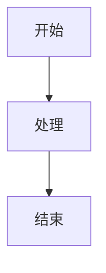

# 内容模块 (src/content) - AI 开发指南

[根目录](../../CLAUDE.md) > **src/content**

---

## 模块职责

管理博客的 Markdown 内容，通过 Astro Content Collections 提供类型安全的内容查询和元数据管理。所有博客文章和特殊页面都存储在此目录。

---

## 入口与启动

### 内容配置文件

**文件**：`src/content/config.ts`

**作用**：定义 Content Collections 的 Schema，确保所有 Markdown 文件的 frontmatter 符合类型约束。

```typescript
import { defineCollection, z } from 'astro:content';

const postsCollection = defineCollection({
  schema: z.object({
    title: z.string(),
    published: z.date(),
    updated: z.date().optional(),
    draft: z.boolean().optional().default(false),
    description: z.string().optional().default(""),
    image: z.string().optional().default(""),
    tags: z.array(z.string()).optional().default([]),
    category: z.string().optional().nullable().default(""),
    lang: z.string().optional().default(""),
    pinned: z.boolean().optional().default(false),
    hideFromHome: z.boolean().optional().default(false),
    encrypted: z.boolean().optional().default(false),
    password: z.string().optional().default(""),
    series: z.string().optional(),
    // ... 其他字段
  }),
});

export const collections = {
  posts: postsCollection,
  spec: specCollection,
};
```

---

## 对外接口

### Content Collections

| Collection 名称 | 目录路径 | 用途 | 文件数量 |
|----------------|---------|------|---------|
| **posts** | `src/content/posts/` | 博客文章 | ~17 篇 |
| **spec** | `src/content/spec/` | 特殊页面（about、friends） | 2 篇 |

### 内容查询 API

```typescript
import { getCollection, getEntry } from 'astro:content';

// 获取所有已发布文章
const posts = await getCollection('posts', ({ data }) => !data.draft);

// 获取单篇文章
const post = await getEntry('posts', 'tutorials/guide');

// 按分类过滤
const tutorials = posts.filter(p => p.data.category === 'tutorials');

// 按标签过滤
const taggedPosts = posts.filter(p => p.data.tags.includes('Astro'));

// 排序（最新优先）
const sortedPosts = posts.sort((a, b) =>
  b.data.published.valueOf() - a.data.published.valueOf()
);
```

---

## 关键依赖与配置

### 依赖项

- **astro:content**：Astro 内置内容管理 API
- **zod**：Schema 验证库
- **reading-time**：阅读时间计算（通过 Remark 插件注入）

### 插件集成

通过 Remark/Rehype 插件自动增强内容：

- **remark-reading-time**：自动计算 `remarkPluginFrontmatter.readingTime`
- **remark-excerpt**：提取摘要到 `remarkPluginFrontmatter.excerpt`
- **rehype-slug**：为标题添加 ID
- **rehype-autolink-headings**：为标题添加锚点链接

---

## 数据模型

### Frontmatter 字段说明

#### 必填字段

```yaml
---
title: 文章标题
published: 2025-01-01  # 发布日期（YYYY-MM-DD）
---
```

#### 可选字段

```yaml
---
# SEO 相关
description: 文章描述（用于 SEO 和摘要）
image: ./cover.jpg    # 封面图（相对路径或绝对 URL）

# 分类与标签
tags: [Astro, Web开发]
category: 教程

# 文章状态
draft: false          # 是否为草稿（true 不会发布）
updated: 2025-01-02   # 最后更新日期
pinned: false         # 是否置顶
hideFromHome: false   # 是否在首页隐藏

# 多语言
lang: zh_CN           # 文章语言（默认继承站点语言）

# 加密功能
encrypted: false      # 是否加密
password: ""          # 加密密码（encrypted=true 时必填）

# 系列文章
series: Astro入门教程  # 系列名称（用于关联文章）

# 许可证（可选，覆盖全局配置）
author: johntime
sourceLink: https://example.com
licenseName: CC BY-NC-SA 4.0
licenseUrl: https://creativecommons.org/licenses/by-nc-sa/4.0/
---
```

#### 内部字段（自动生成，不需要手动填写）

```yaml
---
prevTitle: 上一篇文章标题
prevSlug: 上一篇文章路径
nextTitle: 下一篇文章标题
nextSlug: 下一篇文章路径
---
```

---

## 内容管理工作流

### 1. 创建新文章

#### 方法 A：使用脚本（推荐）

```bash
pnpm new-post my-new-post
```

生成文件：`src/content/posts/my-new-post.md`

#### 方法 B：手动创建

1. 在 `src/content/posts/` 下创建文件（支持嵌套目录）
2. 添加 frontmatter：

```markdown
---
title: 我的新文章
published: 2025-11-12
description: ''
image: ''
tags: []
category: ''
draft: false
lang: ''
---

# 文章标题

这里是文章内容...
```

### 2. 编辑文章

- **推荐编辑器**：VSCode + Astro 插件
- **实时预览**：运行 `pnpm dev`，访问 http://localhost:4321
- **Markdown 语法**：支持 GitHub Flavored Markdown + 自定义扩展

### 3. 添加封面图

#### 方法 A：相对路径（推荐）

```yaml
---
image: ./cover.jpg
---
```

将 `cover.jpg` 放在与文章同目录。

#### 方法 B：公共资源

```yaml
---
image: /assets/images/my-cover.jpg
---
```

将图片放在 `public/assets/images/` 下。

#### 方法 C：外部链接

```yaml
---
image: https://example.com/image.jpg
---
```

### 4. 发布文章

1. 设置 `draft: false`
2. 提交到 Git 仓库
3. 推送到 GitHub（触发 CI/CD 自动部署）

---

## 内容分类与组织

### 目录结构示例

```
src/content/posts/
├── tutorials/                 # 教程分类
│   ├── firefly.md
│   ├── guide.md
│   └── markdown-tutorial.md
├── wordpress-import/          # WordPress 迁移的文章
│   ├── post-2025-02-12.md
│   └── post-2025-02-17.md
└── draft.md                   # 草稿示例
```

### 分类策略

- **按主题分类**：使用 `category` 字段（如 "教程"、"技术"、"生活"）
- **按目录分类**：使用子目录组织相关文章
- **按系列分类**：使用 `series` 字段关联系列文章

---

## Markdown 扩展语法

### 支持的扩展

#### 1. 数学公式（KaTeX）

```markdown
行内公式：$E = mc^2$

块级公式：
$$
\int_{-\infty}^{\infty} e^{-x^2} dx = \sqrt{\pi}
$$
```

#### 2. Mermaid 图表

````markdown

````

#### 3. 自定义提示框

```markdown
:::note
这是一条提示信息。
:::

:::tip
这是一条建议。
:::

:::warning
这是一条警告。
:::

:::caution
这是一条注意事项。
:::

:::important
这是一条重要信息。
:::
```

#### 4. GitHub 卡片

```markdown
:::github{repo="saicaca/fuwari"}
:::
```

#### 5. 代码块增强

````markdown
```javascript title="example.js" {1-3} showLineNumbers
// 这是标题
const x = 1;
console.log(x);
```
````

---

## 测试与质量

### 内容验证

**类型检查**：
```bash
pnpm astro check
```

如果 frontmatter 不符合 Schema，会报错。

### 常见错误

1. **日期格式错误**：必须是 `YYYY-MM-DD` 格式
   ```yaml
   # 错误
   published: 2025/01/01
   # 正确
   published: 2025-01-01
   ```

2. **标签格式错误**：必须是数组
   ```yaml
   # 错误
   tags: Astro
   # 正确
   tags: [Astro]
   ```

3. **图片路径错误**：相对路径必须以 `./` 开头
   ```yaml
   # 错误
   image: cover.jpg
   # 正确
   image: ./cover.jpg
   ```

---

## 常见问题 (FAQ)

### Q1：如何批量导入 Markdown 文件？

**A**：
1. 将文件放入 `src/content/posts/` 目录
2. 确保每个文件都有有效的 frontmatter
3. 运行 `pnpm astro check` 验证
4. 运行 `pnpm build` 测试构建

### Q2：如何隐藏草稿文章？

**A**：设置 `draft: true`，文章不会出现在构建结果中。

### Q3：如何实现文章加密？

**A**：
```yaml
---
encrypted: true
password: "your-password"
---
```

用户需要输入密码才能查看文章内容。

### Q4：如何实现文章置顶？

**A**：
```yaml
---
pinned: true
---
```

置顶文章会在首页优先显示。

### Q5：如何修改文章 URL？

**A**：文章 URL 由文件路径决定：
- `src/content/posts/my-post.md` → `/posts/my-post`
- `src/content/posts/tutorials/guide.md` → `/posts/tutorials/guide`

### Q6：如何删除文章？

**A**：
1. **方法 A**：删除文件
2. **方法 B**：设置 `draft: true`（保留文件但不发布）

---

## 相关文件清单

```
src/content/
├── config.ts                      # Collection 类型定义（核心）
├── posts/                         # 博客文章目录
│   ├── tutorials/                 # 教程文章
│   │   ├── firefly.md
│   │   ├── guide.md
│   │   ├── markdown-tutorial.md
│   │   └── ...
│   ├── wordpress-import/          # WordPress 迁移文章
│   │   ├── post-2025-02-12.md
│   │   └── ...
│   └── draft.md                   # 草稿示例
└── spec/                          # 特殊页面
    ├── about.md                   # 关于页面
    └── friends.md                 # 友链页面
```

---

## 变更记录

### 2025-11-12 - 初始化
- 创建内容模块文档
- 记录 frontmatter 字段和内容管理工作流

---

**提示**：所有内容修改都会在下次构建时生效，开发模式下支持热更新！
